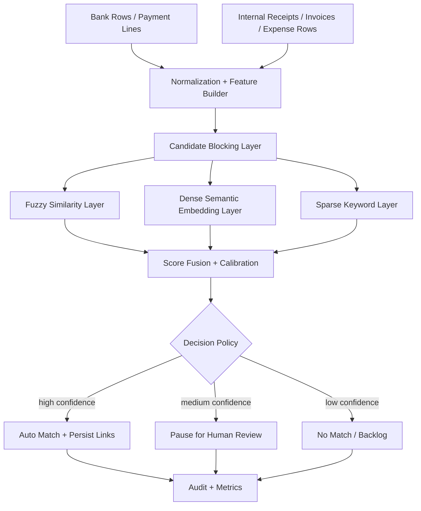

# Semantic / Fuzzy Transaction Matching Design (Isolated from Document RAG)

## 1. Goal

Build a dedicated neural + fuzzy matching layer for transaction reconciliation cases where textual labels do not match literally.

Example:

- bank text: `CHEVRON 4921 ZURICH`
- internal receipt text: `Patrol - Team Travel`

Expected outcome:

- produce ranked candidate matches with confidence and explanation,
- route high-confidence candidates to auto-match,
- route ambiguous candidates to user confirmation,
- keep all matching indexes, embeddings, and APIs separate from document RAG.

---

## 2. Non-Negotiable Isolation Rules

Do not reuse the document RAG vector path for reconciliation matching.

Isolation rules:

1. Separate vector collections
- `rag_chunks_dense` / `rag_chunks_sparse`: document retrieval only.
- `tx_match_dense` / `tx_match_sparse`: transaction matching only.

2. Separate embedding purpose tags
- RAG embeddings tagged `purpose=document_rag`.
- Transaction embeddings tagged `purpose=transaction_match`.

3. Separate retrieval APIs
- Document: `/api/query`, `/api/interaction/...`
- Matching: `/api/reconciliation/match/...`

4. Separate scoring pipeline
- RAG relevance score cannot be used as reconciliation match score.
- Reconciliation score must be generated by a dedicated matcher.

5. Separate retention and ACL
- Transaction matching index can include sensitive financial metadata.
- Access control and retention policy must be independent from document search.

---

## 3. High-Level Architecture



---

## 4. Data Model (Matching Lane)

## 4.1 Entity Views

Create normalized matching views (or materialized tables):

1. `tx_match_source_view`
- bank/payment side rows
- fields: `source_id`, `amount`, `currency`, `booking_date`, `description_raw`, `counterparty_hint`, `reference_raw`

2. `tx_match_target_view`
- invoice/receipt/expense side rows
- fields: `target_id`, `amount`, `currency`, `doc_date`, `description_raw`, `vendor_name`, `reference_raw`, `cost_center`

## 4.2 Feature Store Table

`tx_match_features`

- `record_id`
- `record_side` (`source` or `target`)
- `description_norm`
- `party_norm`
- `amount_norm`
- `date_bucket`
- `reference_tokens` (jsonb)
- `dense_embedding` (optional cache key or vector hash)
- `sparse_vector` (hash-token form)
- `updated_at`

## 4.3 Candidate and Outcome Tables

1. `tx_match_candidates`
- pair-level scores and features
- `source_id`, `target_id`, `fuzzy_score`, `semantic_score`, `sparse_score`, `amount_score`, `date_score`, `final_score`

2. `tx_match_decisions`
- final decision with reason
- `decision` in (`auto_match`, `needs_review`, `no_match`)
- `decision_confidence`, `explanation_json`, `review_state`

---

## 5. Retrieval and Candidate Generation

Use two-stage retrieval to keep latency stable.

Stage 1: Candidate blocking

- same currency (or FX-convertible bucket)
- amount tolerance window
- date window (configurable)
- optional vendor/counterparty coarse filter

Stage 2: Similarity scoring on blocked set

- fuzzy lexical score
- semantic embedding cosine score
- sparse overlap score (reference codes, IDs, token overlap)

This avoids all-pairs explosion.

---

## 6. Similarity Stack

## 6.1 Fuzzy Lexical Features

Use deterministic fuzzy features first:

- token-set ratio
- token-sort ratio
- normalized edit distance
- character n-gram cosine

Good for near-lexical cases and OCR noise.

## 6.2 Semantic Embedding Features

Embed business-facing transaction strings, not raw document chunks.

Example embedding text template:

`"desc={description_norm}; party={party_norm}; ref={reference_raw}; amount={amount}; currency={currency}; date={booking_date}"`

Use separate model config for matching lane:

- `IDMS_TX_MATCH_EMBED_MODEL`
- never share collection names with document query engine.

## 6.3 Sparse / Keyword Features

Keep sparse vectors for identifiers:

- invoice numbers
- card terminal IDs
- station codes
- route numbers
- booking references

This handles exact IDs that dense embeddings may miss.

---

## 7. Score Fusion and Decision Policy

Compute fused score:

$$
S = w_f F + w_e E + w_s K + w_a A + w_d D
$$

Where:

- $F$: fuzzy score
- $E$: embedding semantic score
- $K$: sparse keyword score
- $A$: amount compatibility score
- $D$: date proximity score

Initial default weights:

- `w_f=0.25`
- `w_e=0.35`
- `w_s=0.15`
- `w_a=0.15`
- `w_d=0.10`

Decision thresholds (configurable):

- `S >= 0.86`: `auto_match`
- `0.70 <= S < 0.86`: `needs_review`
- `S < 0.70`: `no_match`

Ambiguity guard:

- if top-1 and top-2 delta `< 0.05`, force `needs_review` even if top-1 exceeds auto threshold.

---

## 8. Explainability Contract

Every candidate should expose explanation fields:

- `matched_tokens`: overlapping key tokens
- `semantic_neighbors`: nearest semantic terms
- `amount_reason`: exact / tolerance / split
- `date_reason`: within window or not
- `final_reason`: weighted summary

Example:

```json
{
  "source_id": "bank_2026_06_30_4421",
  "target_id": "receipt_9912",
  "final_score": 0.83,
  "decision": "needs_review",
  "explanation": {
    "matched_tokens": ["chevron", "zurich"],
    "semantic_hint": "fuel/travel expense",
    "amount_reason": "exact_amount_match",
    "date_reason": "within_3_days",
    "ambiguity": "top2_close_gap_0.03"
  }
}
```

---

## 9. API Design (Separate Namespace)

Introduce isolated endpoints:

1. `POST /api/reconciliation/match/preview`
- accepts source rows + optional target scope
- returns ranked candidates and decision class without persistence

2. `POST /api/reconciliation/match/commit`
- persists chosen match decisions
- writes `tx_match_decisions` + relationship links

3. `POST /api/reconciliation/match/feedback`
- captures user accept/reject corrections for calibration

4. `GET /api/reconciliation/match/metrics`
- precision, review rate, false-positive drift

No document RAG endpoint should call these internally.

---

## 10. SOLF / Workflow Integration

Use existing workflow execution model, but dedicated operations.

Proposed new `workflow_domain_operation` names:

1. `build_tx_match_candidates`
2. `score_tx_match_candidates`
3. `decide_tx_match_outcomes`
4. `persist_tx_match_outcomes`
5. `queue_tx_match_reviews`

Example sequence:

1. pipeline step `build_tx_match_candidates`
2. pipeline step `score_tx_match_candidates`
3. pipeline step `decide_tx_match_outcomes`
4. if review needed: pause + human review
5. pipeline resume -> `persist_tx_match_outcomes`

---

## 11. Implementation Blueprint

Phase 1: foundation

1. create isolated storage schema/tables for matching lane
2. create separate Qdrant collections (`tx_match_dense`, `tx_match_sparse`)
3. implement normalization + feature builder module

Phase 2: matcher engine

1. implement candidate blocking
2. implement fuzzy + semantic + sparse scorers
3. implement score fusion and threshold policy

Phase 3: workflow and API

1. add `/api/reconciliation/match/*` routes
2. add domain functions and allowlist entries
3. add SOLF templates for preview/commit/pause flows

Phase 4: calibration

1. store feedback labels
2. calibrate weights and thresholds per tenant/domain
3. monitor precision/recall and review load

---

## 12. Guardrails Against RAG Mixing

Technical controls:

1. hardcoded namespace prefixes
- reject any transaction-match request targeting `rag_*` collections.

2. purpose validation
- every embedding request must include `purpose`.
- reject if `purpose` mismatches endpoint type.

3. service-layer split
- `document_search_service.py` and `tx_matching_service.py` must not import each other.

4. config split
- separate env vars and API keys if needed:
  - `QDRANT_RAG_URL`, `QDRANT_TX_MATCH_URL`
  - or same cluster with strict collection ACL.

5. audit checks
- log collection names and endpoint names for every query.
- periodic job flags any cross-lane access.

---

## 13. Test Plan

Core scenarios:

1. lexical mismatch, semantic match
- `CHEVRON 4921 ZURICH` vs `Patrol - Team Travel`
- expected: candidate appears with semantic reason and review/auto based on confidence.

2. exact reference should dominate
- matching invoice number in bank reference should outrank semantic-only candidates.

3. ambiguous top-2
- near-equal candidates trigger `needs_review`.

4. no-match
- unrelated descriptions + amount/date mismatch -> `no_match`.

Isolation tests:

1. transaction endpoint cannot query `rag_chunks_*` collections.
2. document query endpoint cannot query `tx_match_*` collections.
3. embedding logs always show correct `purpose` tag.

---

## 14. Suggested File Layout

1. `IDMS-Demo/tx_matching/normalization.py`
2. `IDMS-Demo/tx_matching/features.py`
3. `IDMS-Demo/tx_matching/candidates.py`
4. `IDMS-Demo/tx_matching/scoring.py`
5. `IDMS-Demo/tx_matching/decision.py`
6. `IDMS-Demo/tx_matching/storage.py`
7. `IDMS-Demo/idms_api_server/routers/reconciliation_match.py`
8. `IDMS-Demo/log/SEMANTIC_FUZZY_TRANSACTION_MATCHING_DESIGN.md`

---

## 15. Bottom Line

Yes, this should be implemented as a dedicated matching intelligence lane.

- Use fuzzy + semantic + sparse signals together.
- Keep retrieval and scoring isolated from document RAG.
- Integrate with workflow/SOLF via dedicated operations.
- Make ambiguity explicit and review-driven rather than forcing wrong auto-matches.

---

## 16. Ingestion Policy for Booking Documents

Short answer: yes, include ingestion into the separate transaction-matching index for booking-relevant docs, but do it selectively.

Do not index all documents into the transaction lane.

## 16.1 What to index into tx_match collections

Index when document type is booking-relevant and structured extraction succeeded:

1. `invoice`
2. `bill`
3. `receipt`
4. bank statement/payment feed rows (source-side records)

Index payload should be row-level transaction features, not full markdown chunks.

## 16.2 What NOT to index into tx_match collections

Do not index into tx_match lane:

1. generic non-accounting documents
2. contracts/policies unless explicitly configured as reconciliation targets
3. full document text already handled by document RAG

These remain in the existing document retrieval index only.

## 16.3 Recommended write strategy in ingestion workflow

Use dual-write with strict separation:

1. document RAG indexing continues as-is for retrieval/Q&A,
2. transaction-match indexing writes only normalized booking rows to `tx_match_dense` and `tx_match_sparse`.

Execution mode:

1. synchronous minimal write for critical keys (record ids and metadata),
2. async/background embedding write for dense vectors to avoid blocking ingestion latency.

## 16.4 Workflow hook placement

Attach tx-match indexing after booking-related process derivation in ingestion flow (invoice/bill/receipt path), then enqueue:

1. normalize transaction row,
2. upsert feature record in `tx_match_features`,
3. upsert vectors in `tx_match_dense`/`tx_match_sparse`.

If indexing fails, ingestion should continue and log a recoverable `tx_match_index_pending` task.

## 16.5 Configuration flags

Add separate controls so teams can roll out safely:

1. `IDMS_ENABLE_TX_MATCH_INDEX=true|false`
2. `IDMS_TX_MATCH_DOC_TYPES=invoice,bill,receipt`
3. `IDMS_TX_MATCH_ASYNC_EMBED=true|false`
4. `IDMS_TX_MATCH_MIN_FIELDS=amount,currency,date,description`

## 16.6 Practical recommendation

For your case, enable tx-match ingestion for invoice/receipt/bill and bank/payment rows only.

That gives matching coverage for booking workflows without polluting the transaction index with unrelated document RAG content.

---

## 17. Implemented Ops Layer (Queue + Retry)

The following operational components are now implemented:

1. Pending queue table
- `tx_match_index_pending`
- stores failed tx-match indexing attempts from ingestion
- includes payload, error, retry_count, status timestamps

2. Retry worker command
- File: `IDMS-Demo/tx_match_retry_worker.py`
- Example:

```powershell
c:/Project/WebTech/python/.venv/Scripts/python.exe IDMS-Demo/tx_match_retry_worker.py --status pending --status failed --limit 50
```

3. Maintenance APIs
- `GET /api/maintenance/tx-match/pending`
- `GET /api/maintenance/tx-match/pending/{pending_id}`
- `POST /api/maintenance/tx-match/pending/retry`

4. Regression script for queue endpoints
- File: `IDMS-Demo/log/run_tx_match_pending_queue_regression.py`
- Example:

```powershell
c:/Project/WebTech/python/.venv/Scripts/python.exe IDMS-Demo/log/run_tx_match_pending_queue_regression.py --base-url http://127.0.0.1:8000 --admin-token <token-if-required>
```

5. Token guard for maintenance operations
- tx-match maintenance endpoints enforce `IDMS_MAINTENANCE_TOKEN` when configured.
- pass token via:
  - `admin_token` query param for GET endpoints
  - `admin_token` field in retry POST body

6. Scheduler helper scripts
- `IDMS-Demo/scripts/run_tx_match_retry_worker.ps1`
- `IDMS-Demo/scripts/register_tx_match_retry_task.ps1`

Register Windows scheduled task (example every 15 minutes):

```powershell
PowerShell -ExecutionPolicy Bypass -File IDMS-Demo/scripts/register_tx_match_retry_task.ps1 -TaskName IDMS-TxMatch-Retry-Queue -IntervalMinutes 15
```

7. Lifecycle integration script (queued -> retried -> indexed)
- File: `IDMS-Demo/log/run_tx_match_queue_lifecycle_integration.py`
- Uses env-gated test mode in worker:
  - `IDMS_TX_MATCH_ALLOW_TEST_FORCE_SUCCESS=true`
  - payload flag `force_index_success=true`

Run:

```powershell
c:/Project/WebTech/python/.venv/Scripts/python.exe IDMS-Demo/log/run_tx_match_queue_lifecycle_integration.py --cleanup
```

---

## 18. Generic Matching Collection Mode (Implemented)

The indexing path now supports a generic matching collection model while keeping backward compatibility with tx-match settings.

Implemented behavior:

1. Default collection resolution
- uses `IDMS_MATCH_QDRANT_COLLECTION` when set,
- otherwise falls back to existing `IDMS_TX_MATCH_QDRANT_COLLECTION`.

2. Optional per-workflow collection override
- ingestion can set `matching_collection` in document metadata/processing directives,
- override is guarded by `IDMS_MATCH_ALLOW_COLLECTION_OVERRIDE=true|false`,
- collection names are validated (`[A-Za-z0-9_-]`, length 3..96).

3. Mandatory matching metadata at point payload level
- `purpose`
- `workflow_scope`
- `tenant_scope`
- `matching_collection`

4. Retry compatibility
- queued retry payload now carries matching metadata,
- replay keeps collection and purpose semantics.

### Example metadata fields for generic workflows

```json
{
  "metadata": {
    "processing_directives": {
      "matching_collection": "idms_demo_generic_match",
      "matching_purpose": "entity_resolution",
      "matching_workflow_scope": "workflow:vendor_dedupe_v2",
      "matching_tenant_scope": "tenant:acme"
    }
  }
}
```

## 19. Reconciliation-Specific Features That Are Now Generic-Ready

The following features can now be reused by other matching workflows:

1. Vector lane isolation by `purpose` metadata.
2. Shared matching collection with filter-first retrieval (`purpose`, `workflow_scope`, `tenant_scope`).
3. Retry queue and worker (`tx_match_index_pending` + `tx_match_retry_worker.py`) as a generic failed-index replay mechanism.
4. Maintenance endpoints for pending/retry operations (token-protected).
5. Scheduler wrappers for periodic retry execution.

Recommended next extension:

1. Rename tx-specific API/path labels to neutral aliases while preserving compatibility.
2. Add retrieval endpoint requiring filter triplet (`purpose`, `workflow_scope`, `tenant_scope`).
3. Add policy allowlist for permitted purposes per tenant/workflow.

---

## 20. Generic Matching Query API (Implemented)

New endpoint:

- `POST /api/matching/query`
- `POST /api/matching/candidates` (metadata-only listing, no embedding query)

Required request filters:

1. `purpose`
2. `workflow_scope`
3. `tenant_scope`

Optional fields:

1. `collection_name`
2. `top_k`

For `POST /api/matching/candidates`, pagination uses:

1. `cursor` in request (optional)
2. `next_cursor` in response (empty string when exhausted)

This endpoint enforces purpose allowlist policy and applies all three metadata filters at vector query time.

### Environment policy controls

1. `IDMS_MATCH_QDRANT_COLLECTION` (default generic matching collection)
2. `IDMS_MATCH_ALLOW_COLLECTION_OVERRIDE=true|false`
3. `IDMS_MATCH_ALLOWED_PURPOSES=transaction_match,entity_resolution,...` (supports `*`)

### Example request

```json
{
  "query_text": "Chevron fuel transaction Zurich",
  "workflow_key": "rule::bank_recon_v1",
  "purpose_alias": "rule_bank_recon_v1::matching_purpose",
  "workflow_scope_alias": "rule_bank_recon_v1::workflow_scope",
  "tenant_scope": "tenant:acme",
  "top_k": 10,
  "collection_alias": "rule_bank_recon_v1::matching_collection"
}
```

### Example metadata-only listing request

```json
{
  "workflow_key": "rule::bank_recon_v1",
  "purpose_alias": "rule_bank_recon_v1::matching_purpose",
  "workflow_scope_alias": "rule_bank_recon_v1::workflow_scope",
  "tenant_scope": "tenant:acme",
  "doc_type": "invoice",
  "limit": 50,
  "cursor": "",
  "collection_alias": "rule_bank_recon_v1::matching_collection"
}
```
